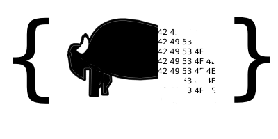

# bison


A JSON to binary tool. This tool takes in JSON and converts it to a binary structure to save some bytes. This library is intended to serialize a JSON object similar to how you might expect with something like `JSON.stringify`.


## Installing
`npm i @jeffriggle/bison`

## Basic usage
```javascript
const { encode, decode } = require('@jeffriggle/bison/cjs/index')

const jsonObject = {
    hello: 'World',
    num: 42,
    required: false
    nested: {
        foo: 'bar',
        arr: [42, 15, 'baz']
    }
}

const encoded = encode(jsonObject)
console.log(encoded) // binary structure.
const decoded = decode(encoded)
console.log(decoded) // original object.
```

## Examples
Examples using bison can be found here https://github.com/JeffreyRiggle/bison-examples

## Initial testing
All testing has been done on a local development machine, results may vary. To run the tests yourself use the `npm run perf:nano` through `npm run perf:large` commands provided by this package.

### Encoding
Basic encoding in this case is using a very simple approach

```javascript
const encoded = Buffer.from(JSON.stringify(obj))
```

| Encode Type | Encode Size | Encode Time |
| - | - | - |
| Basic nano | 12 | 0.168547 |
| Bison nano | 9 | 0.668347 |
| Basic small | 114 | 0.180368 |
| Bison small | 91 | 1.210133 |
| Basic medium | 501609 | 2.040591 |
| Bison medium | 473877 | 67.735946 |
| Basic large | 1003207 | 5.178138 |
| Bison large | 947742 | 133.127045 |

### Decoding
Basic decoding in this case is using a very simple approach

```javascript
const decoded = JSON.parse(buff.toString('utf8'))
```

| Decode Type | Decode Time |
| - | - |
| Basic nano | 65.414897 |
| Bison nano | 63.667062 |
| Basic small | 65.364427 |
| Bison small | 63.256234 |
| Basic medium | 160.526895 |
| Bison medium | 135.599895 |
| Basic large | 216.865982 |
| Bison large | 176.570844 |

### Totals

| Type | Total time delta | Size delta |
| - | - | - |
| nano | +1.248035 | +3 |
| small | +1.078428 | +23 |
| medium | -40.768355 | +27732 |
| large | -87.653769 | +55465 |

_Time differences are Basic - Bison (positive numbers are improvements)_
